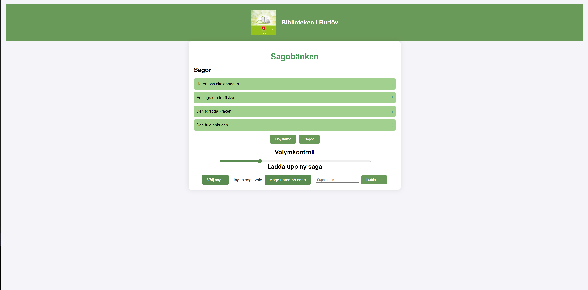

# Fairy Tale Bench

This is an application that will run on AXIS C1610-VE Network Sound Projector, it is a basic custom app to manage audio files on the speaker.

## Installation

This application is made to be deployed on the speaker, to see how to make application and package it to be depoyed on AXIS network devices see [Axis GitHub](https://github.com/AxisCommunications/acap-native-sdk-examples). In this project Hello World example is used as a base to develope the application.[Hello World](https://github.com/AxisCommunications/acap-native-sdk-examples/tree/main/hello-world).

## Accessibility

After Installation, go to "https://<ip_address>/local/audiomanager/index.html" and log in with AXIS device username/password.

## Support

To see all the AxisCommunications APIs go to [VAPIX Library](https://www.axis.com/vapix-library/).
To read about developing applications to be deployed on AXIS devices go to [ACAP SDK Documentation](https://axiscommunications.github.io/acap-documentation/)

## Authors and acknowledgment

Joakim Roubert at AxisCommunications was a big help and support.
